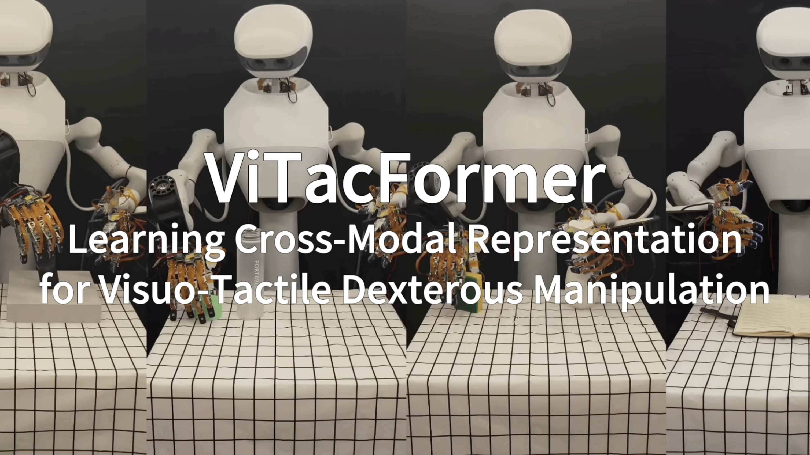
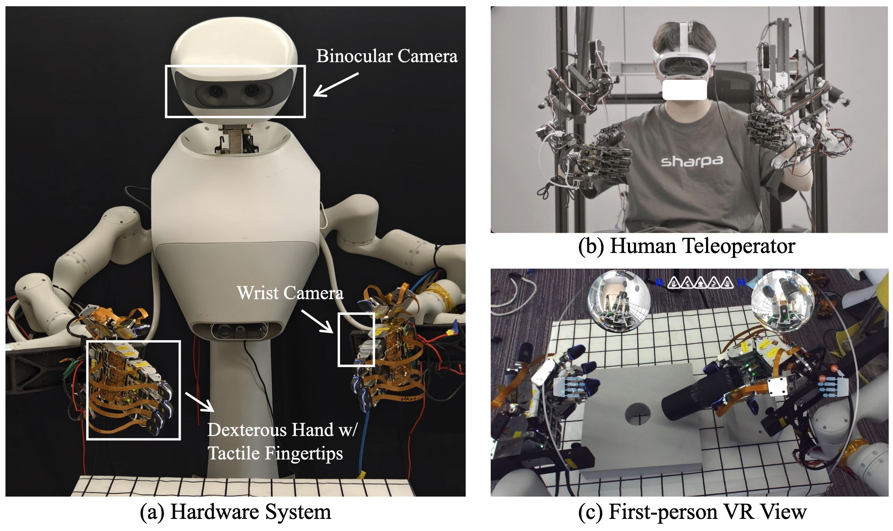

<p align="center">
  <h1 align="center">ViTacFormer: Learning Cross-Modal Representation for Visuo-Tactile Dexterous Manipulation</h1>
</p>




<p align="center">
  <a href="https://roboverseorg.github.io/ViTacFormerPage/"></a>
  <a href="https://arxiv.org/abs/2506.15953"></a>
  <a href="https://github.com/RoboVerseOrg/ViTacFormer/issues"></a>
</p>

## News

- **2026-05-23**: Released `inference.sh` for real-time policy deployment.
- **2026-04-27**: ViTacFormer accepted to **RSS 2026**!

## Hardware Setup



Our hardware setup consists of an **active vision system**, a **bi-manual robot arm**, and **two high-DoF dexterous hands (SharpaWave)** equipped with **high-resolution tactile sensors**.

To enable rich data collection, we use a **teleoperation system** with **precision exoskeleton**  for fine-grained arm and finger control, plus a **VR interface** to control the camera and guide demonstrations.

## Installation

    conda create -n vitacformer python=3.8.10
    conda activate vitacformer
    pip install torchvision
    pip install torch
    pip install opencv-python
    pip install matplotlib
    pip install tqdm
    pip install einops
    pip install h5py
    pip install ipython
    pip install transforms3d
    pip install zarr
    pip install transformers
    pip install pyzmq                  
    pip install pytorch-kinematics     
    cd dataset/ha_data && pip install -e .
    cd detr && pip install -e .

## Example Usages

Please download and unzip the example data [here](https://drive.google.com/file/d/1GzQSymfzw2YDY0VtCyutV5LnmFRbu0nm/view?usp=sharing). To train ViTacFormer, run:

    conda activate vitacformer
    bash train.sh

## Inference

`inference.py` runs the trained policy as a ZMQ client that connects to a robot or simulator backend on `tcp://127.0.0.1:7778`. Edit the checkpoint paths in `inference.sh`, start your backend server, then:

    bash inference.sh

The backend must publish per-frame observations (images, joint angles, 20 tactile sensor channels) and consume per-frame absolute joint-angle action targets. Action chunking and temporal ensemble are handled inside `inference.py`.

## Citation
If you find ViTacFormer useful, please consider citing it:
```bibtex
@misc{heng2026vitacformerlearningcrossmodalrepresentation,
      title={ViTacFormer: Learning Cross-Modal Representation for Visuo-Tactile Dexterous Manipulation}, 
      author={Liang Heng and Haoran Geng and Kaifeng Zhang and Pieter Abbeel and Jitendra Malik},
      year={2026},
      eprint={2506.15953},
      archivePrefix={arXiv},
      primaryClass={cs.RO},
      url={https://arxiv.org/abs/2506.15953}, 
}
```
